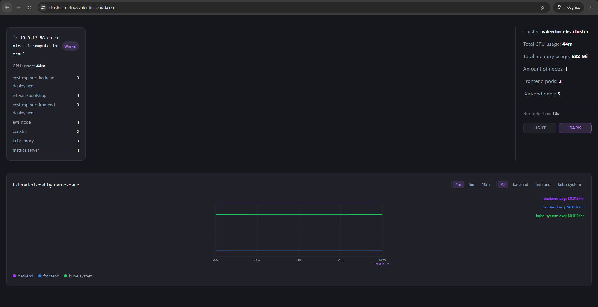

# Kubernetes Cluster Metrics & Cost Explorer

## Overview
A dashboard that tracks per-namespace resource usage and estimated cost across a Kubernetes cluster in real time. It snapshots pod resource requests on an interval, prices them against real AWS EC2 on-demand rates for whichever node they're running on, stores the history in Postgres, and exports hourly cost reports to S3.

## Architecture
### AWS infrastructure
VPC across 2 AZs, EKS + Multi-AZ RDS in private subnets, NAT gateway per AZ for outbound access, an IAM OIDC provider for IRSA, and Route53/ACM for TLS on the frontend load balancer.

### Kubernetes cluster
Frontend and backend Deployments in their own namespaces, each behind an HPA, with IRSA-backed ServiceAccounts for AWS access instead of static credentials.

## Key Design Decisions

### Availability
- Multi-AZ (EKS nodes + RDS across 2 AZs)
- RDS Multi-AZ standby replica for automatic failover
- One NAT gateway + EIP per AZ, so private subnet egress survives an AZ outage
- EKS node group: 2-4 nodes (one per AZ at baseline), CPU-based target tracking scales the ASG and covers AZ failure

### Scalability
- HPA on frontend + backend: 3–30 pods, CPU-based

### Security
- No static AWS credentials — IRSA for S3, RDS, and Pricing API
- Dedicated ServiceAccount + read-only ClusterRole
- Private subnets, no public IPs
- TLS via a Route53-hosted domain + DNS-validated ACM certificate on the frontend NLB

